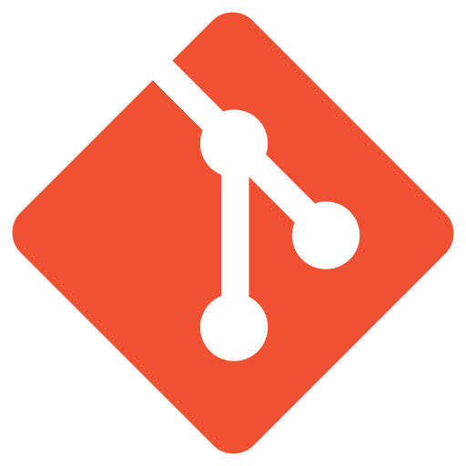

## 

### 👩‍💻 About me:

- 🌱 I'm pursuing Bachelor's Degree in Computer Science at [University of Engineering and Technology (UET-VNU)](https://uet.vnu.edu.vn/).
- 🔭 I’m currently working in the field of Infrastructure.
- ⚡ Favourite quote: "There is no right path, just keep trying and getting mistakes".
- 💬 Feel free to ask me about anything about my work or new opportunities.
- 📫 Contact me through: [phungducanh2511@.gmail.com](mailto:phungducanh2511@gmail.com).

### 🛠 Languages & tools:

          
  

    
    
    
    
    
    
    
    
        
        
  

### ✉ Connect with me via:

&nbsp;

  
| ------------------------------------------------------------------------------------------------------------- |

  

